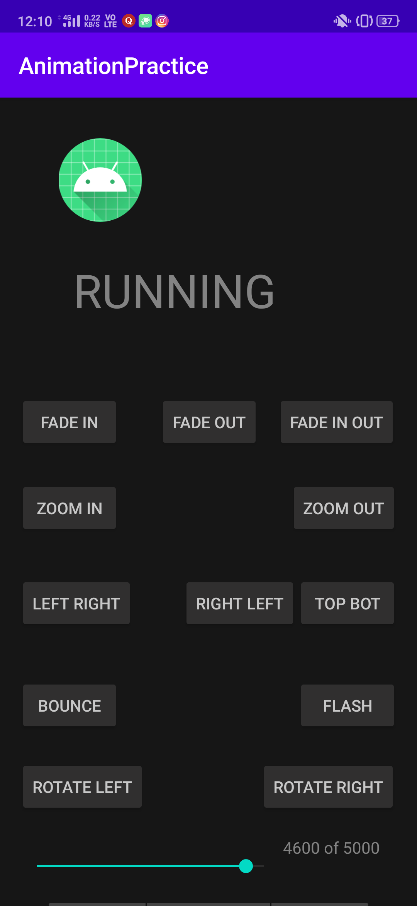

# AnimationPractice
Learned Animation using Animation.AnimationListener interface

## Screenshots
    

## What it includes?
- It is a simple application to show various animations in android.
- Also used slider widget to control the speed of the animations.
